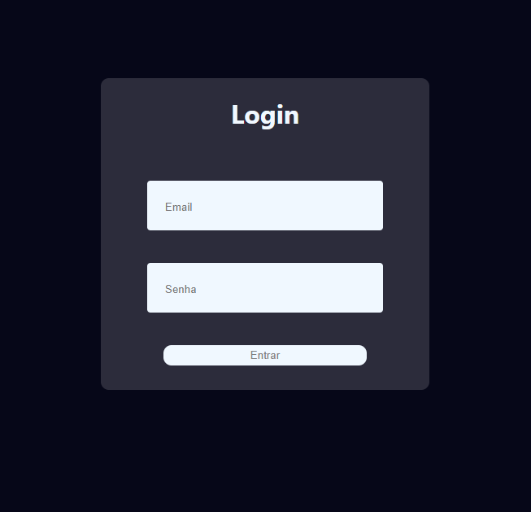
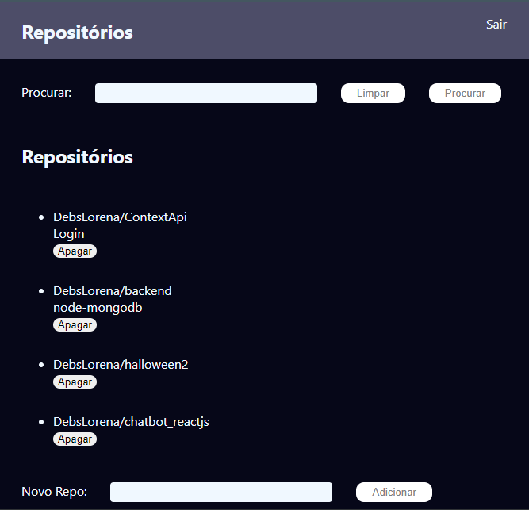

 

  <h1>Bem Vindos(as)!!</h1>
  <strong>Crud com Login - Backend</strong>

 

    
    

## ✌️ Crud com login * Backend
<strong> Crud em ReactJs com MongoDB e Node: gerenciamento de repositórios do Github com login e senha que permita adicionar, remover, 
pesquisar e deletar, exibe a lista de repositórios apenas do usuário logado. Em uso Node, Mongo, Cors, Express, Sucrase, Nodemon, JWT. 

### 🎨 Backend

*  **Backend**: NodeJs, MongoDB com Visual Studio Code 

## 🙌 Quer Contribuir?

Que tal:
* 🤔 Sugira um recurso
* 🐛 Informar um problema
* 📖 Melhore a documentação
* 👨‍💻 Contribua com o código

Você é mais que bem vindo! 

Obs: Todos os textos e imagens atuais são ficticios, projeto não concluso.

    <h6>Feito com ❤️ by DebsLorena</h6>
    <a href="https://www.linkedin.com/in/loredebs/"><strong>Linkedin</strong></a> 
    <a href="https://www.instagram.com/debslorena/"><strong>Instagram</strong></a>

